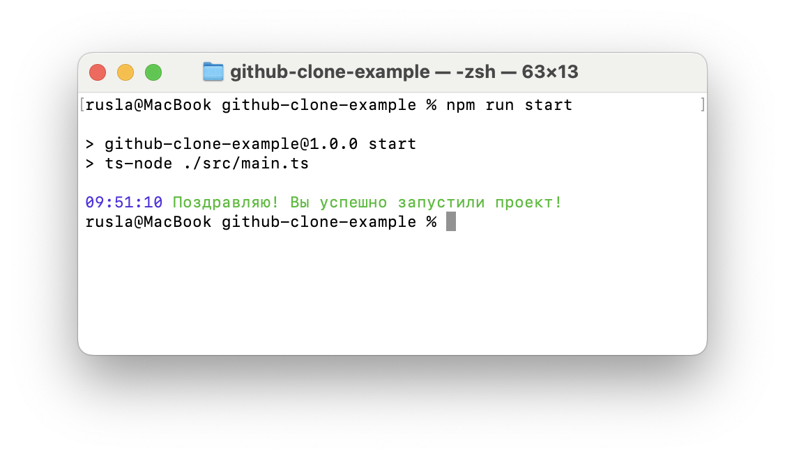

## Демонстрационный проект для клонирования и запуска

### Клонирование
Чтобы склонировать репозиторий себе на устройство, необходимо воспользоваться командой `git clone`,
общий вид команды:
```bash
git clone git@github.com:<NICK>/<PROJECT>.git <foldername?>
```
Где
* `<NICK>` - имя пользователя github
* `<PROJECT>` - имя проекта github
* `<foldername?>` - имя папки в которую склонировать. Опционально, по умолчанию будет создана папка
с таким же именем, как `<PROJECT>`.

#### Примеры установки
Установить (скачать) проект в папку `github-clone-example`
```bash
git clone git@github.com:Mauzzz0/github-clone-example.git
```

Установить (скачать) проект в папку `my_project`
```bash
git clone git@github.com:Mauzzz0/github-clone-example.git my_project
```


### Установка зависимостей
После успешного клонирования проекта, необходимо установить зависимости используя `npm i` или `npm ci`.

Перейти в созданную папку (если вы использовали имя по умолчанию)
```bash
cd github-clone-example
```

Установить зависимости из `package-lock.json` файла
```bash
npm ci
```


### Запуск проекта
Запустить проект можно с помощью команды `npm run start`

#### Успешный запуск
После успешного запуска проекта вы должны увидеть следующее сообщение
